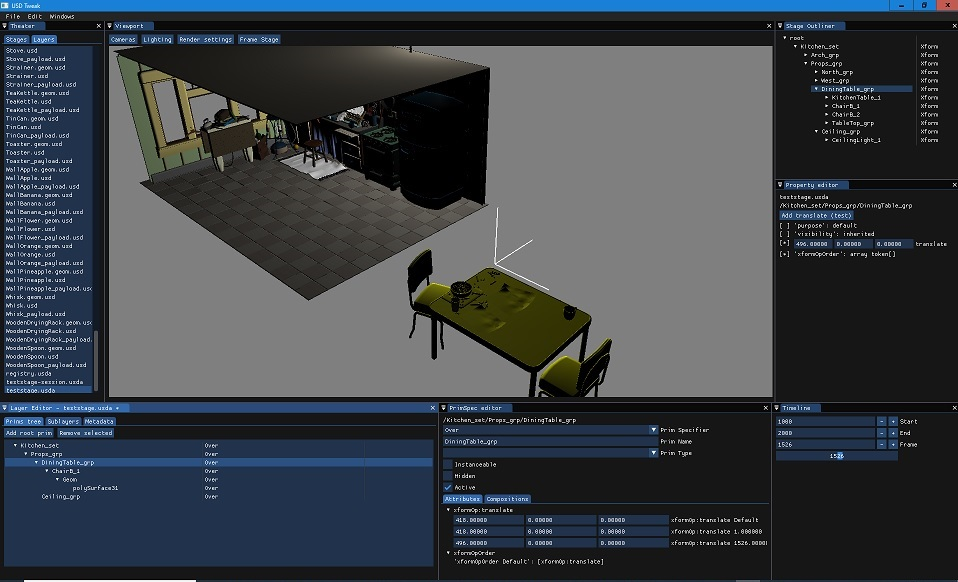

# primspector

A free and open source Pixar's Universal Scene Description editor, still in early development.

The UI is built upon [ImGUI](https://github.com/ocornut/imgui) and is fully C++/OpenGL. The code is organised such that it should eventually be possible to reuse the widgets in other OpenGL+USD projects.

## Status

The editor is still an early prototype but allows to edit multiple stages and layers, add or delete prims in layers, add references, change values, translate objects in the viewport, etc. The original idea is to edit not only stages, but also layers, as you would with a text editor. The development is slow as this on of my side project outside of work and I spend very little time on it at the moment.

## Building

### Requirement

The project is almost self contained and only needs:

- cmake > 3.6 and a C++14 compiler installed
- a build of [Universal Scene Description](https://github.com/PixarAnimationStudios/USD/releases/tag/v20.11) version 20.11
- a build of [GLFW](https://www.glfw.org/), version 3.3.2 works

### Compiling

If you managed to build USD, compiling primspector should be straightforward, cmake needs only 2 variables:

- __pxr_DIR__ pointing to the USD installation directory containing the file pxrConfig.cmake
- __glfw3_DIR__  pointing to the USD installation directory containing the file glfw3Config.cmake

on linux it goes along the lines of:

    git clone https://github.com/cpichard/primspector
    cd primspector
    git checkout develop
    mkdir build
    cd build
    cmake -Dpxr_DIR=/installs/usd-20.11 -Dglfw3_DIR=/installs/glfw-3.3.2/lib/cmake/glfw3 ..
    make

It should compile successfully on Windows 10 with MSCV 19, Centos 7 with g++ and MacOS Catalina. The viewport doesn't work on mac as the OpenGL version is not supported, but the layer editor does.

## Contact

If you are interest by this project, want to know more or contribute, drop me an email: cpichard.github@gmail.com
